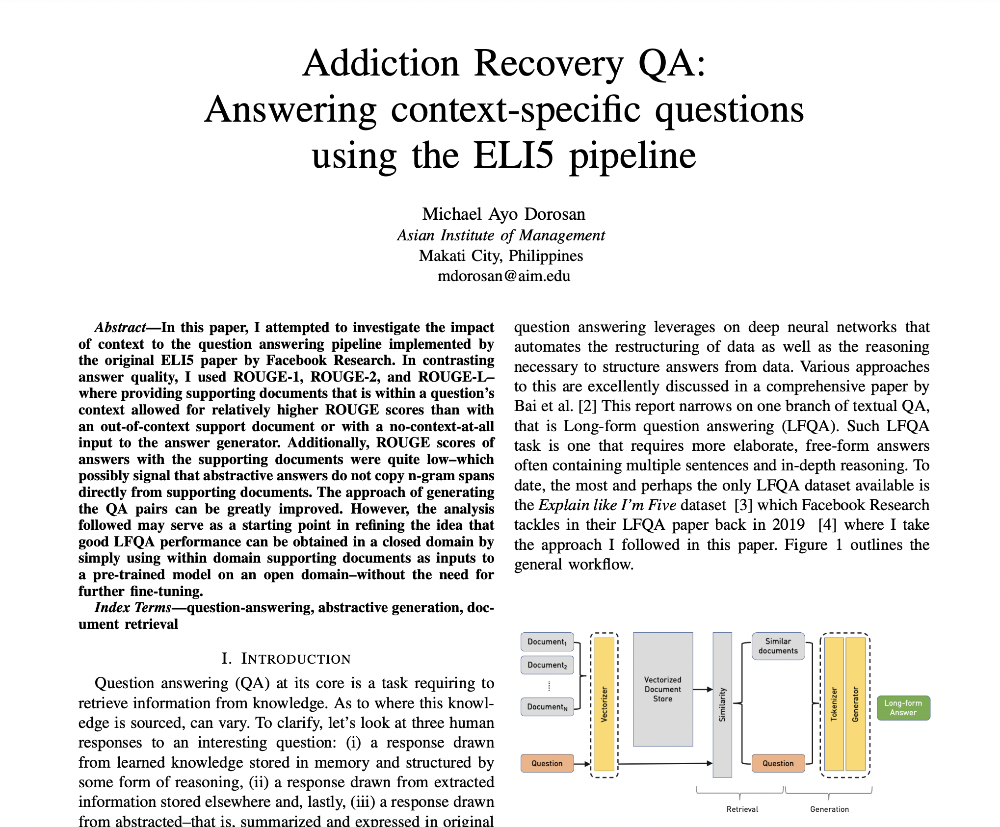

# Addiction Recovery Chatbot: Experimenting on the use of an open-domain QA pretrained model

In this mini project, I experimented on the use of an open-domain pretrained sentence-level pretrained model for use in a closed domain.

Such a closed domain is captured in the niche task of building an addiction recovery chatbot which takes addiction recovery-related questions and answers using context documents from religious speeches. Findings are limited by the data set used---that is, most of Q-A pairs used are of low quality because these were primarily sourced from rhetorical questions (i.e., questions used to introduce a topic or to encourage interest) in a test set of speeches instead of genuine questions from addicts. The pursuit, however, is worthwhile and the challenges experienced clarify the direction one must take to realize such a pursuit: an [ELI5](https://www.reddit.com/r/explainlikeimfive/)-like data set for addiction recovery counselling.

I heavily take from the pipeline of yjernite in this [blog post](https://yjernite.github.io/lfqa.html) by making use of the pretrained models made available in huggingface.

All model training and pipeline credits go to yjernite. My tweaks mainly come in in the use of a closed-domain context data set and the test cases done.

## Experiment summary and report

I organized my findings into a [report attached as a pdf file](addiction-recovery-open-to-closed-domain-abstractive-qa-report.pdf) in this repository. For a preview, see the image below.

